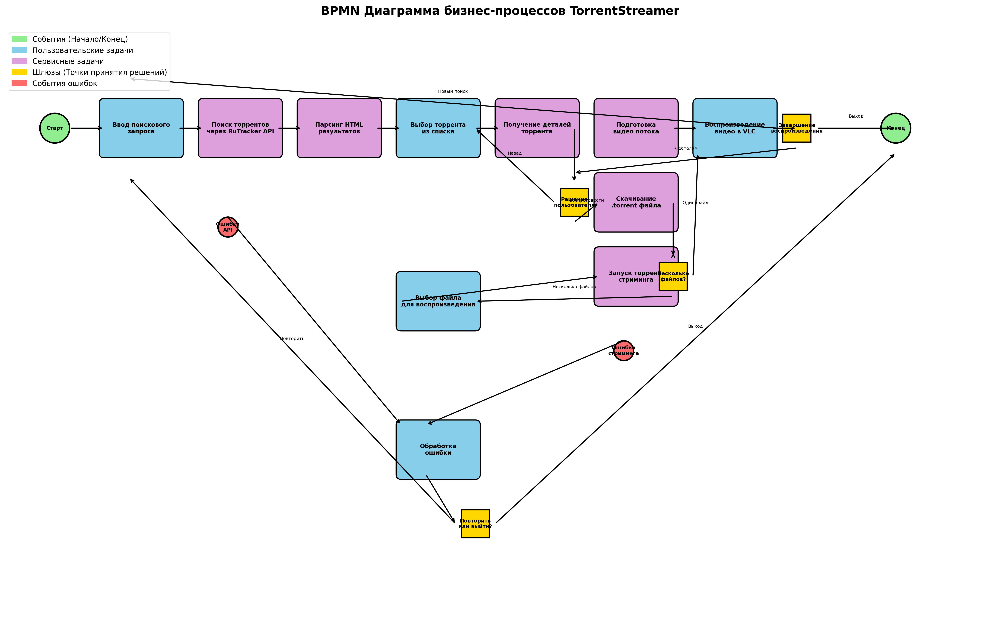

# 📚 Документация TorrentStreamer

Добро пожаловать в документацию проекта TorrentStreamer - iOS приложения для поиска, стриминга и воспроизведения торрент-контента.

## 📋 Содержание документации

### 🔄 [Бизнес-процессы](./BUSINESS_PROCESS_DESCRIPTION.md)
Подробное описание всех бизнес-процессов приложения, включая:
- Процесс поиска торрентов
- Просмотр деталей торрента
- Стриминг контента
- Воспроизведение видео
- Обработка ошибок

### 📊 BPMN Диаграммы

#### [Визуальная диаграмма](./torrent_streamer_bpmn_diagram.png)

Наглядное представление всех бизнес-процессов с цветовой кодировкой:
- 🟢 События (Начало/Конец)
- 🔵 Пользовательские задачи
- 🟣 Сервисные задачи
- 🟡 Шлюзы (Точки принятия решений)
- 🔴 События ошибок

#### [BPMN XML файл](./torrent_streamer_business_process.bpmn)
Стандартный BPMN 2.0 файл, который можно открыть в любом BPMN редакторе:
- Camunda Modeler
- Bizagi Modeler
- Draw.io
- Lucidchart

## 🏗️ Архитектура проекта

### Ветки проекта
- **main** - MVC архитектура
- **detailVC-mvvm** - MVVM архитектура с Combine framework

### Ключевые компоненты
1. **RutrackerApiManager** - управление API запросами
2. **HTML Parser** - парсинг данных с RuTracker
3. **Torrent Streamer** - управление торрент-загрузками
4. **VLC Media Player** - воспроизведение видео

## 🚀 Основные функции

### Поиск торрентов
- Интеграция с RuTracker.org API
- Фильтрация по категориям и параметрам
- Парсинг HTML результатов

### Стриминг
- Загрузка торрент-файлов
- Потоковое воспроизведение
- Поддержка множественных файлов

### Воспроизведение
- Интеграция с VLC плеером
- Поддержка различных видео форматов
- Управление воспроизведением

## 🔧 Технологии

- **iOS SDK** - нативная разработка
- **UIKit** - пользовательский интерфейс
- **Combine** - реактивное программирование (MVVM ветка)
- **Kanna** - HTML парсинг
- **MobileVLCKit** - видео плеер
- **Swift** - язык программирования

## 📈 Возможности для развития

1. **Кэширование результатов поиска**
2. **Офлайн режим просмотра**
3. **Пользовательские настройки**
4. **Расширенные фильтры поиска**
5. **Социальные функции**
6. **Улучшения безопасности**

## 🤝 Вклад в проект

При внесении изменений в проект, пожалуйста:
1. Обновляйте соответствующую документацию
2. Следуйте архитектурным принципам выбранной ветки
3. Добавляйте тесты для новой функциональности
4. Обновляйте BPMN диаграммы при изменении бизнес-процессов

---

*Документация создана автоматически на основе анализа кода проекта*